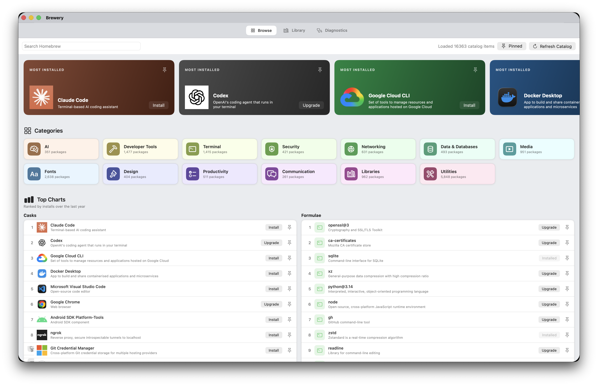
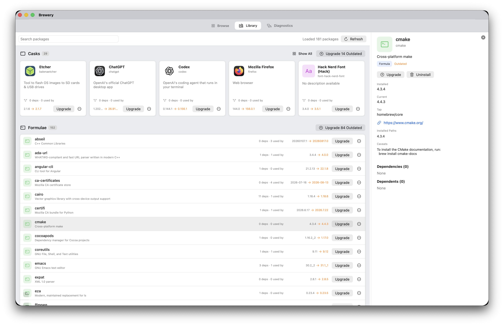
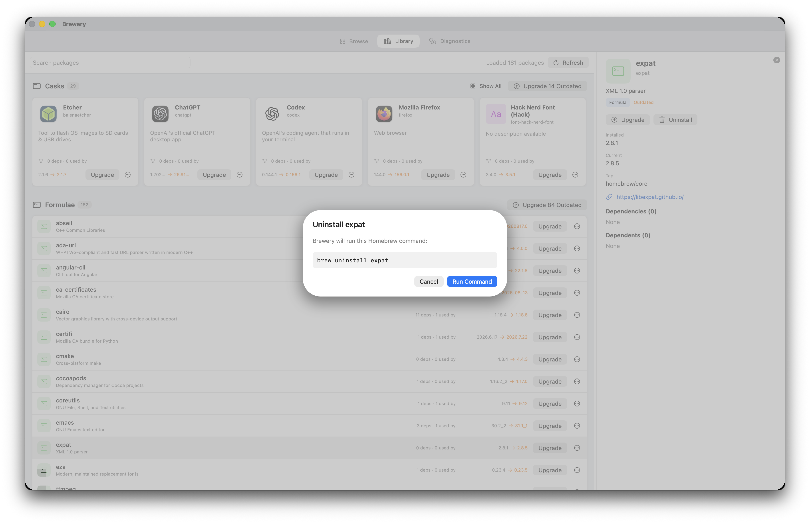
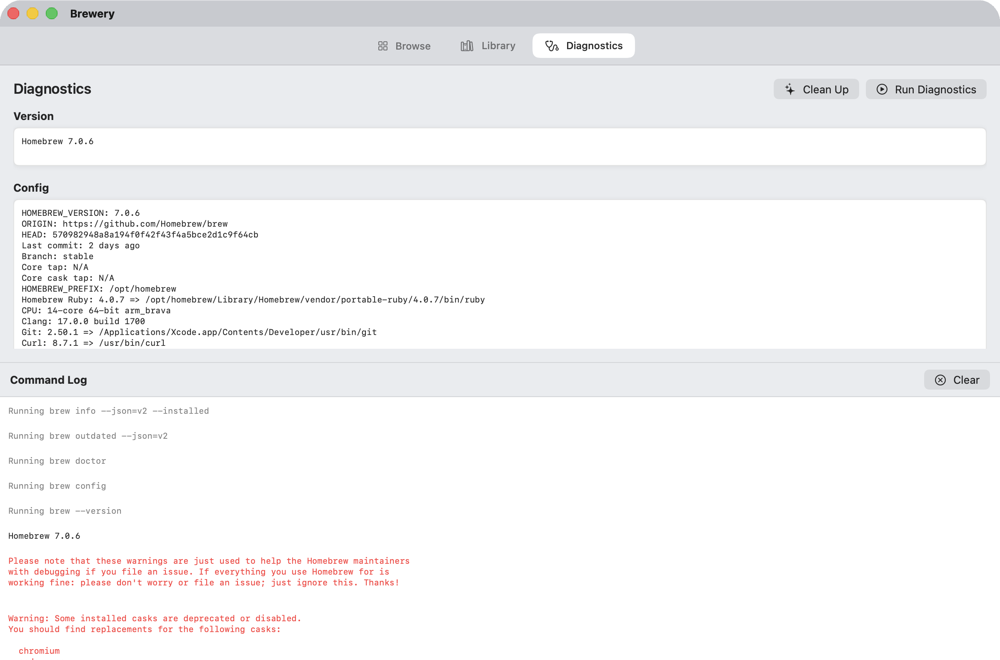

<div align="center">
  
  <h1>Brewery</h1>
  <p><b>A native SwiftUI client for Homebrew: browse the catalog like an app store, manage what you have installed, and see what depends on what before you uninstall it.</b></p>
</div>

Brewery has three pages. Browse lays out every official formula and cask as category shelves with real app icons, ranked by Homebrew's own install counts. Library shows what is installed, outdated packages first, with the dependency graph built in memory from Homebrew's JSON so "what breaks if this goes" sits next to the Uninstall button. Diagnostics runs Homebrew's health checks and keeps the command log. Every mutating command is shown to you in full and confirmed before it runs.

<picture>
  <source media="(prefers-color-scheme: dark)" srcset="Docs/Screenshots/brewery-browse-dark.png">
  
</picture>

## Install

Download the latest release from [GitHub Releases](https://github.com/3M1RY33T/brewery/releases), unzip if needed, and move `Brewery.app` to your `Applications` folder.

Brewery is not signed or notarized yet. On first launch macOS will refuse to open it: open it from Finder with Control-click > Open, and confirm once.

## Browse the whole catalog

Search every official formula and cask, or scroll the shelves: a carousel of the most installed packages, category tiles for AI, developer tools, terminal, security, networking, data, media, fonts, design, productivity, communication, libraries and utilities, and Top Charts ranked by Homebrew's install analytics for the last year. Casks show the icon of the app they install; formulae and fonts get a glyph. Pin anything from any shelf and it collects under the Pinned button in the header. The catalog is cached locally, so it still opens when a network refresh fails.

## Manage what is installed

Library shows installed casks as cards and formulae as a list, with outdated packages first and an Upgrade All button on each section. Selecting a package opens its detail pane: versions, tap, homepage, caveats, then its direct dependencies and direct dependents. Every entry there is clickable, so the graph can be walked in either direction. In a narrow window the pane moves beneath the content instead of beside it.

<picture>
  <source media="(prefers-color-scheme: dark)" srcset="Docs/Screenshots/brewery-library-dark.png">
  
</picture>

## Nothing runs without confirmation

Install, upgrade, uninstall and cleanup all stop here first. The exact `brew` command is printed, and nothing executes until you press Run Command. Output is streamed into the command log on the Diagnostics page as it happens.

<picture>
  <source media="(prefers-color-scheme: dark)" srcset="Docs/Screenshots/brewery-confirm-dark.png">
  
</picture>

## Diagnostics

`brew --version`, `brew config` and `brew doctor`, read without leaving the app, with the command log beneath them and a Clean Up button for `brew cleanup`.

<picture>
  <source media="(prefers-color-scheme: dark)" srcset="Docs/Screenshots/brewery-diagnostics-dark.png">
  
</picture>

## Requirements

- macOS 12 or newer
- Homebrew installed at `/opt/homebrew/bin/brew`, `/usr/local/bin/brew`, or discoverable from a sanitized login shell `PATH`

Swift 5.9 or newer is only needed when building from source.

## Features

- Detect an existing Homebrew installation.
- Browse official Homebrew formulae and casks as category shelves, a most-installed carousel and Top Charts, ranked by Homebrew's install analytics.
- Show real app icons for casks, resolved from the installed app bundle or the project's homepage.
- Pin catalog entries and collect them under the Pinned button.
- Cache the browse catalog locally and use cached data when network refresh fails.
- Load installed formulae and casks with `brew info --json=v2 --installed`, and outdated packages with `brew outdated --json=v2`.
- Manage the library: upgrade or uninstall a package, or upgrade every outdated cask or formula at once.
- Build an in-memory dependency graph from Homebrew JSON instead of running per-package dependency commands.
- Show direct dependencies and dependents in the package detail pane, beside the content or beneath it in narrow windows.
- Confirm before running mutating commands: install, upgrade, uninstall and cleanup.
- Stream command output into the log on the Diagnostics page.
- Show diagnostics from `brew --version`, `brew config` and `brew doctor`.

## Build from source

Clone the repository, then build and open the local app bundle:

```sh
Scripts/run-app.sh
```

SwiftPM can compile the app with `swift run Brewery`, but macOS GUI apps need an `.app` bundle for a normal LaunchServices run. `Scripts/run-app.sh` builds `.build/Brewery.app` and opens it.

To build the app bundle without opening it:

```sh
Scripts/build-app.sh
```

The build script also generates `BreweryIcon.icns` from `brewery-logo.png` for the local app bundle.

## Test

```sh
swift test
```

## Credits

Brewery is an independent open-source project and is not affiliated with Homebrew or Apple.

Brewery uses Homebrew's command-line interface and official JSON API for package metadata. Homebrew is maintained by the Homebrew project and contributors: https://brew.sh/

Built with SwiftUI.

## Notes

Brewery does not install Homebrew automatically.

### [Install Homebrew on macOS:](https://brew.sh/)

```bash
$ /bin/bash -c "$(curl -fsSL https://raw.githubusercontent.com/Homebrew/install/HEAD/install.sh)"
```
