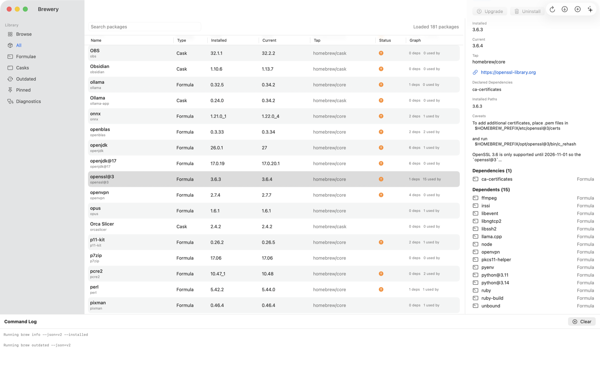

<div align="center">
  
  <h1>Brewery</h1>
  <p><b>A native SwiftUI client for Homebrew that shows you what depends on what, before you uninstall it.</b></p>
</div>

Brewery reads your installed formulae and casks, builds the dependency graph in memory from Homebrew's own JSON, and puts the answer to "what breaks if this goes" next to the uninstall button. Every mutating command is shown to you in full and confirmed before it runs.

<picture>
  <source media="(prefers-color-scheme: dark)" srcset="Docs/Screenshots/brewery-dependencies-dark.png">
  
</picture>

Selecting a package lists its direct dependencies and its direct dependents, and every entry is clickable, so the graph can be walked in either direction. The `Graph` column carries the same two counts for every row in the table.

## Install

Download the latest release from [GitHub Releases](https://github.com/3M1RY33T/brewery/releases), unzip if needed, and move `Brewery.app` to your `Applications` folder.

Brewery is not signed or notarized yet. On first launch macOS will refuse to open it: open it from Finder with Control-click > Open, and confirm once.

## Nothing runs without confirmation

Update, install, upgrade, uninstall and cleanup all stop here first. The exact `brew` command is printed, and nothing executes until you press Run Command. Output is streamed into the log at the bottom of the window as it happens.

<picture>
  <source media="(prefers-color-scheme: dark)" srcset="Docs/Screenshots/brewery-confirm-dark.png">
  
</picture>

## Browse the whole catalog

Search every official formula and cask, laid out as category shelves and ranked by Homebrew's own install counts. The catalog is cached locally, so it still opens when a network refresh fails.

<picture>
  <source media="(prefers-color-scheme: dark)" srcset="Docs/Screenshots/brewery-browse-dark.png">
  
</picture>

## Diagnostics

`brew --version`, `brew config` and `brew doctor`, read without leaving the app.

<picture>
  <source media="(prefers-color-scheme: dark)" srcset="Docs/Screenshots/brewery-diagnostics-dark.png">
  
</picture>

## Requirements

- macOS 12 or newer
- Homebrew installed at `/opt/homebrew/bin/brew`, `/usr/local/bin/brew`, or discoverable from a sanitized login shell `PATH`

Swift 5.9 or newer is only needed when building from source.

## Features

- Detect an existing Homebrew installation.
- Load installed formulae and casks with `brew info --json=v2 --installed`.
- Show outdated packages with `brew outdated --json=v2`.
- Confirm before running mutating commands: update, install, upgrade, uninstall, and cleanup.
- Stream command output into an in-app log.
- Show basic diagnostics from `brew --version`, `brew config`, and `brew doctor`.
- Build an in-memory dependency graph from Homebrew JSON instead of running per-package dependency commands.
- Show direct dependencies and dependents in the package detail pane.
- Browse official Homebrew formulae and casks with an App Store-style catalog view.
- Cache the browse catalog locally and use cached data when network refresh fails.
- Provide sidebar views for the catalog, the installed library, installed formulae, installed casks, outdated packages, pinned packages, and diagnostics.

## Build from source

Clone the repository, then build and open the local app bundle:

```sh
Scripts/run-app.sh
```

SwiftPM can compile the app with `swift run Brewery`, but macOS GUI apps need an `.app` bundle for a normal LaunchServices run. `Scripts/run-app.sh` builds `.build/Brewery.app` and opens it.

To build the app bundle without opening it:

```sh
Scripts/build-app.sh
```

The build script also generates `BreweryIcon.icns` from `brewery-logo.png` for the local app bundle.

## Test

```sh
swift test
```

## Credits

Brewery is an independent open-source project and is not affiliated with Homebrew or Apple.

Brewery uses Homebrew's command-line interface and official JSON API for package metadata. Homebrew is maintained by the Homebrew project and contributors: https://brew.sh/

Built with SwiftUI.

## Notes

Brewery does not install Homebrew automatically.

### [Install Homebrew on macOS:](https://brew.sh/)

```bash
$ /bin/bash -c "$(curl -fsSL https://raw.githubusercontent.com/Homebrew/install/HEAD/install.sh)"
```
