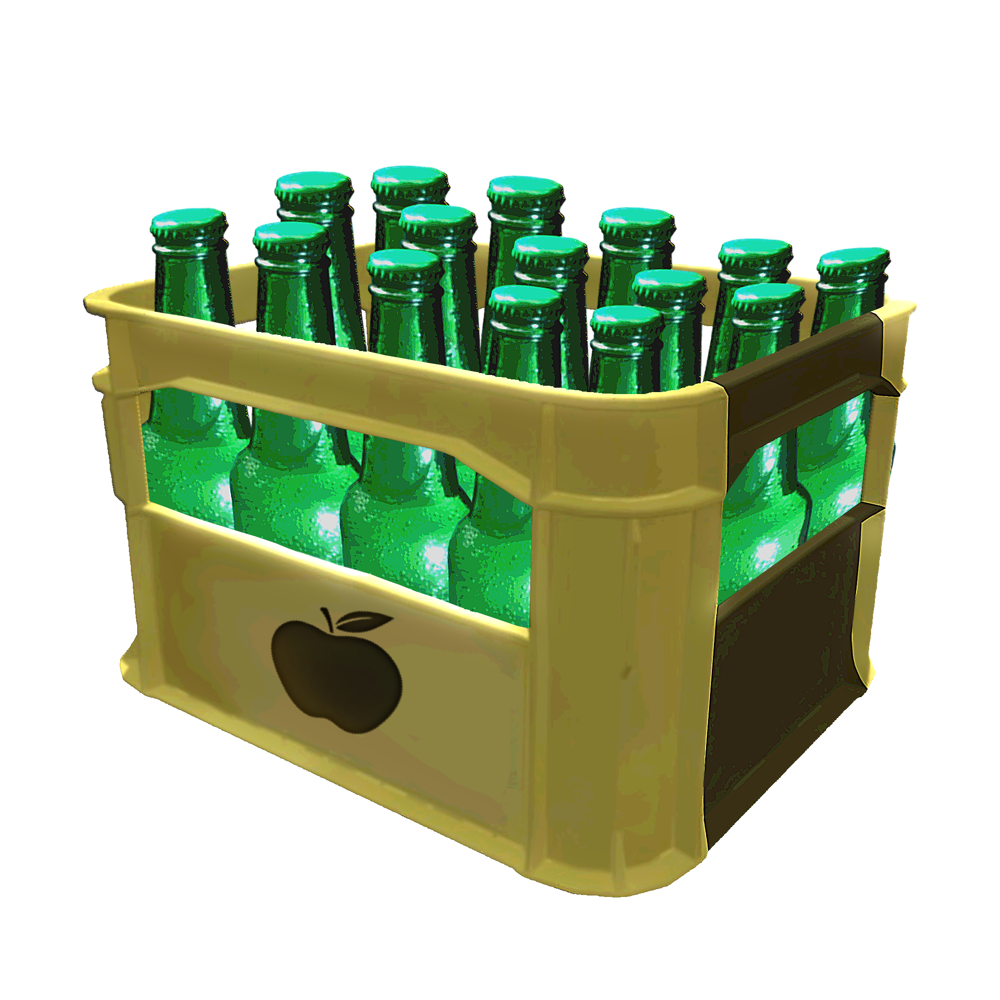
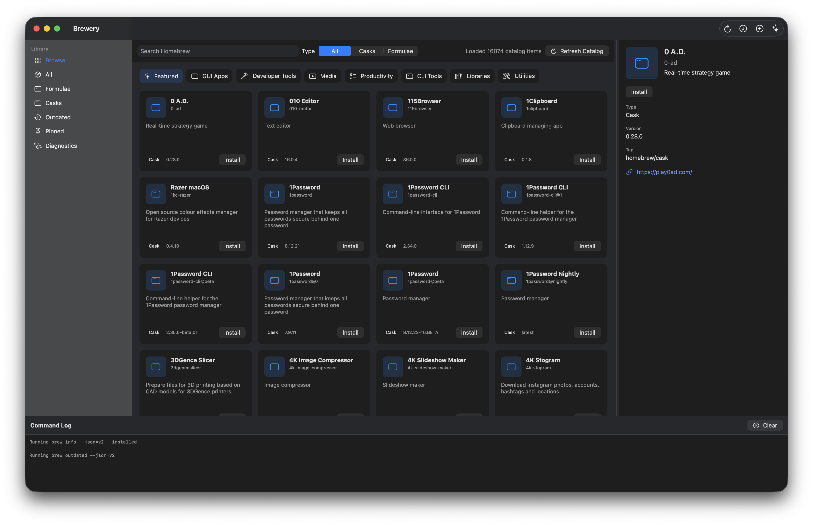

<div align="center">
  
  <h1 style="padding:20px;">Brewery</h1>
</div>

Brewery is a native SwiftUI macOS client for managing local Homebrew formulae and casks. It detects an existing Homebrew installation, loads installed packages, shows outdated status, displays dependency/dependent relationships, and runs package actions only after confirmation.



## Requirements

- macOS 12 or newer
- Homebrew installed at `/opt/homebrew/bin/brew`, `/usr/local/bin/brew`, or discoverable from a sanitized login shell `PATH`

Swift 5.9 or newer is only needed when building from source.

## Install

Download the latest Brewery release from [GitHub Releases](https://github.com/3M1RY33T/brewery/releases), unzip the app if needed, and move `Brewery.app` to your `Applications` folder.

Brewery is distributed as a source-built macOS app for now. If macOS warns that the app cannot be opened because it was downloaded from the internet, open it from Finder with Control-click > Open.

### Manual Build

Clone the repository, then build and open the local app bundle:

```sh
Scripts/run-app.sh
```

SwiftPM can compile the app with `swift run Brewery`, but macOS GUI apps need an `.app` bundle for a normal LaunchServices run. `Scripts/run-app.sh` builds `.build/Brewery.app` and opens it.

To build the app bundle without opening it:

```sh
Scripts/build-app.sh
```

The build script also generates `BreweryIcon.icns` from `brewery-logo.png` for the local app bundle.

## Test

```sh
swift test
```

## Features

- Detect an existing Homebrew installation.
- Load installed formulae and casks with `brew info --json=v2 --installed`.
- Show outdated packages with `brew outdated --json=v2`.
- Confirm before running mutating commands: update, install, upgrade, uninstall, and cleanup.
- Stream command output into an in-app log.
- Show basic diagnostics from `brew --version`, `brew config`, and `brew doctor`.
- Build an in-memory dependency graph from Homebrew JSON instead of running per-package dependency commands.
- Show direct dependencies and dependents in the package detail pane.
- Browse official Homebrew formulae and casks with an App Store-style catalog view.
- Cache the browse catalog locally and use cached data when network refresh fails.
- Provide sidebar filters for all packages, formulae, casks, outdated packages, pinned packages, and diagnostics.

## Credits

Brewery is an independent open-source project and is not affiliated with Homebrew or Apple.

Brewery uses Homebrew’s command-line interface and official JSON API for package metadata. Homebrew is maintained by the Homebrew project and contributors: https://brew.sh/

Built with SwiftUI.

## Notes

Brewery does not install Homebrew automatically.

### [Install Homebrew on MacOS:](https://brew.sh/)

```bash
$ /bin/bash -c "$(curl -fsSL https://raw.githubusercontent.com/Homebrew/install/HEAD/install.sh)"
```
